# Jarkom-Modul-5-A02-2022
Kelompok A02
+ Ferdinand Putra Gumilang Silalahi - 5025201176
+ Naufal Adli Purnama - 5025201195
+ Bimantara Tito Wahyudi - 5025201227

## Soal

### A)
Tugas pertama kalian yaitu membuat topologi jaringan sesuai dengan rancangan yang diberikan Loid

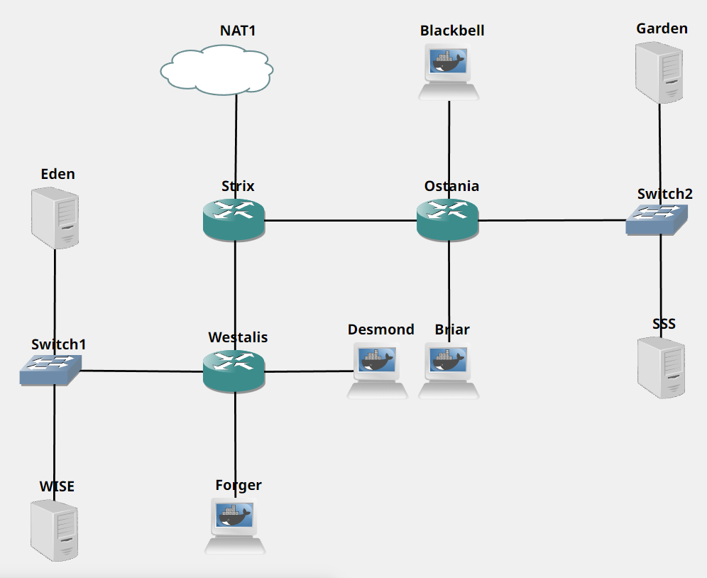

+ Eden adalah DNS Server
+ WISE adalah DHCP Server
+ Garden dan SSS adalah Web Server
+ Jumlah Host pada Forger adalah 62 host
+ Jumlah Host pada Desmond adalah 700 host
+ Jumlah Host pada Blackbell adalah 255 host
+ Jumlah Host pada Briar adalah 200 host

#### Eden
```
echo nameserver 192.168.122.1 > /etc/resolv.conf
apt-get update
apt-get install -y bind9
```

#### WISE
```
echo nameserver 192.168.122.1 > /etc/resolv.conf
apt-get update
apt-get install -y isc-dhcp-server
```

#### Garden
```
echo nameserver 192.168.122.1 > /etc/resolv.conf
apt-get update
apt-get install -y apache2
apt-get install -y libapache2-mod-php7.0
```

#### SSS
```
echo nameserver 192.168.122.1 > /etc/resolv.conf
apt-get update
apt-get install -y apache2
apt-get install -y libapache2-mod-php7.0
```

### B)
Untuk menjaga perdamaian dunia, Loid ingin meminta kalian untuk membuat topologi tersebut menggunakan teknik CIDR atau VLSM setelah melakukan subnetting.

### VLSM

Kelompok kami memutuskan untuk menggunakan metode pembagian IP VLSM

#### 1. Penentuan Netmask
Berikut tabel subnet yang digunakan untuk menentukan kebutuhan netmask dari setiap node. Ditentukan bahwa netmask /21 sudah cukup untuk menjadi root node dari tree VLSM karena hanya terdapat /22, /23, /24, /25, /29, /29, /30, /30, di mana pembagian netmask /21 sudah cukup untuk menutupi kebutuhan setiap node.


#### 2. Pembagian IP
Dibuatkan tree dari penentuan subnet dan node root. Berdasarkan tree VLSM yang dibuat, didapatkan pembagian alamat IP dari setiap subnet.


#### 3. Hasil VLSM
Berikut hasil akhir dari pembagian alamat IP VLSM yang dimasukkan ke dalam tabel untuk memudahkan proses routing dan penyetelan setiap node.


#### Strix
```
auto eth0
iface eth0 inet dhcp
auto eth1
iface eth1 inet static
	address 10.0.0.1
	netmask 255.255.255.252
auto eth2
iface eth2 inet static
	address 10.0.0.5
	netmask 255.255.255.252
```

#### Westalis
```
auto eth0
iface eth0 inet static
	address 10.0.0.2
	netmask 255.255.255.252
auto eth1
iface eth1 inet static
	address 10.0.0.9
	netmask 255.255.255.248
auto eth2
iface eth2 inet static
	address 10.0.0.129
	netmask 255.255.255.128
auto eth3
iface eth3 inet static
	address 10.0.4.1
	netmask 255.255.252.0
```

#### Eden
```
auto eth0
iface eth0 inet static
	address 10.0.0.10
	netmask 255.255.255.248
	gateway 10.0.0.9
```

#### WISE
```
auto eth0
iface eth0 inet static
	address 10.0.0.11
	netmask 255.255.255.248
	gateway 10.0.0.9
```

#### Forger
```
auto eth0
iface eth0 inet dhcp
```

#### Desmond
```
auto eth0
iface eth0 inet dhcp
```

#### Ostania
```
auto eth0
iface eth0 inet static
	address 10.0.0.6
	netmask 255.255.255.252
```

#### Briar
```
auto eth0
iface eth0 inet dhcp
```

#### SSS
```
auto eth0
iface eth0 inet static
	address 10.0.0.19
	netmask 255.255.255.248
	gateway 10.0.0.17
```

#### Garden
```
auto eth0
iface eth0 inet static
	address 10.0.0.18
	netmask 255.255.255.248
	gateway 10.0.0.17
```

#### Blackbell
```
auto eth0
iface eth0 inet dhcp
```

### C)
Anya, putri pertama Loid, juga berpesan kepada anda agar melakukan Routing agar setiap perangkat pada jaringan tersebut dapat terhubung.

#### Strix
```
route add -net 10.0.0.8 netmask 255.255.255.248 gw 10.0.0.2
route add -net 10.0.0.128 netmask 255.255.255.128 gw 10.0.0.2
route add -net 10.0.4.0 netmask 255.255.252.0 gw 10.0.0.2
route add -net 10.0.1.0 netmask 255.255.255.0 gw 10.0.0.6
route add -net 10.0.0.16 netmask 255.255.255.248 gw 10.0.0.6
route add -net 10.0.2.0 netmask 255.255.254.0 gw 10.0.0.6
```

#### Westalis
```
route add -net 0.0.0.0 netmask 0.0.0.0 gw 10.0.0.1
```

#### Ostania
```
route add -net 0.0.0.0 netmask 0.0.0.0 gw 10.0.0.5
```

#### Tes ping Server WISE ke server Garden (10.0.0.19)
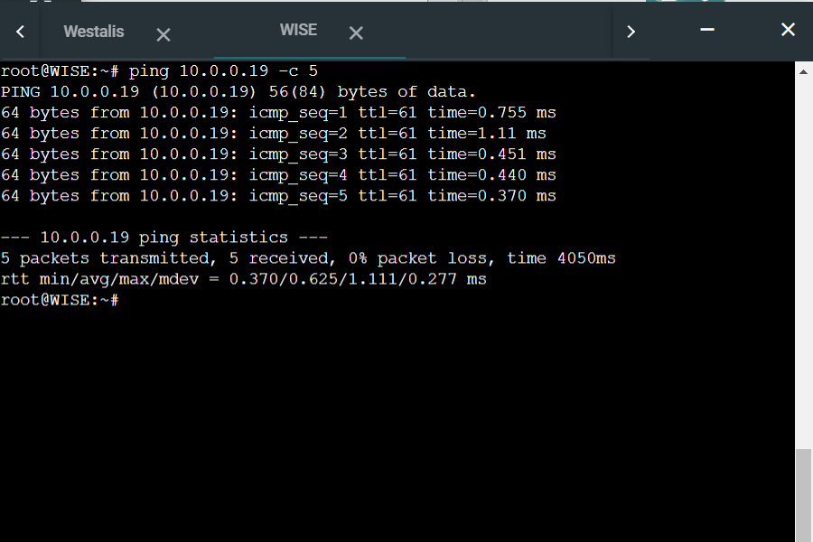

### D)
Tugas berikutnya adalah memberikan ip pada subnet Forger, Desmond, Blackbell, dan Briar secara dinamis menggunakan bantuan DHCP server. Kemudian kalian ingat bahwa kalian harus setting DHCP Relay pada router yang menghubungkannya.

#### WISE
```
subnet 10.0.0.8 netmask 255.255.255.248 {
}

subnet 10.0.0.0 netmask 255.255.255.252 {
}

subnet 10.0.0.4 netmask 255.255.255.252 {
}

subnet 10.0.0.16 netmask 255.255.255.248 {
}

subnet 10.0.0.128 netmask 255.255.255.128 {
    range 10.0.0.130 10.0.0.192;
    option routers 10.0.0.129;
    option domain-name-servers 10.0.0.10;
}

subnet 10.0.4.0 netmask 255.255.252.0 {
    range 10.0.4.2 10.0.6.194;
    option routers 10.0.4.1;
    option domain-name-servers 10.0.0.10;
}

subnet 10.0.1.0 netmask 255.255.255.0 {
    range 10.0.1.2 10.0.1.202;
    option routers 10.0.1.1;
    option domain-name-servers 10.0.0.10;
}

subnet 10.0.2.0 netmask 255.255.254.0 {
    range 10.0.2.2 10.0.3.3;
    option routers 10.0.2.1;
    option domain-name-servers 10.0.0.10;
}
```

#### Client Briar
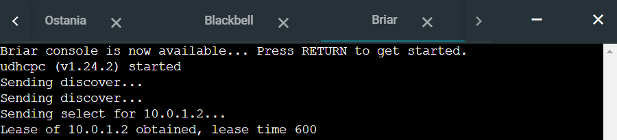

#### Client Blackbell
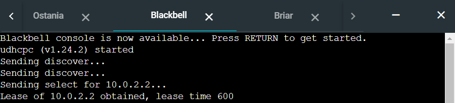

### 1.
Agar topologi yang kalian buat dapat mengakses keluar, kalian diminta untuk mengkonfigurasi Strix menggunakan iptables, tetapi Loid tidak ingin menggunakan MASQUERADE.

```
iptables -t nat -A POSTROUTING -s 10.0.0.0/21 -o eth0 -j SNAT --to-source [Ip Router Strix]
```

#### Tes ping google Server SSS
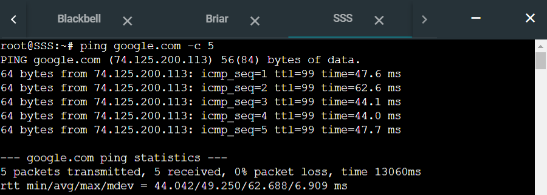

### 2.
Kalian diminta untuk melakukan drop semua TCP dan UDP dari luar Topologi kalian pada server yang merupakan DHCP Server demi menjaga keamanan.

#### Strix
```
iptables -A FORWARD -p tcp -d 10.0.0.11 -i eth0 -j DROP
iptables -A FORWARD -p udp -d 10.0.0.11 -i eth0 -j DROP
```

#### Tes Nping google tcp dan udp Server WISE
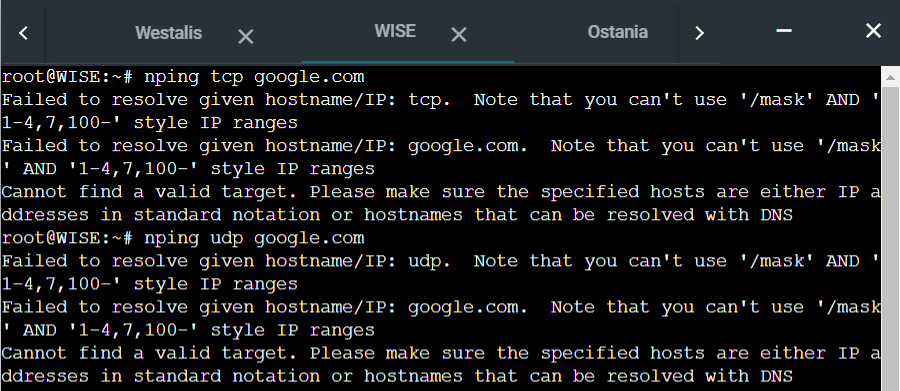

### 3.
Loid meminta kalian untuk membatasi DHCP dan DNS Server hanya boleh menerima maksimal 2 koneksi ICMP secara bersamaan menggunakan iptables, selebihnya didrop.

#### WISE
```
iptables -A INPUT -p icmp -m connlimit --connlimit-above 2 --connlimit-mask 0 -j DROP
```

#### Eden
```
iptables -A INPUT -p icmp -m connlimit --connlimit-above 2 --connlimit-mask 0 -j DROP
```

#### Tes ping ke Server Eden (1)
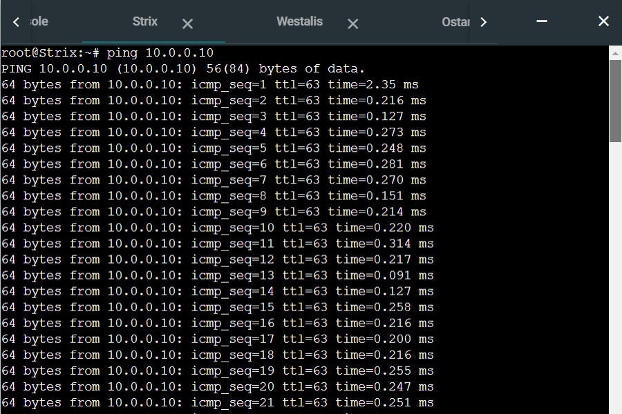

#### Tes ping ke Server Eden (2)
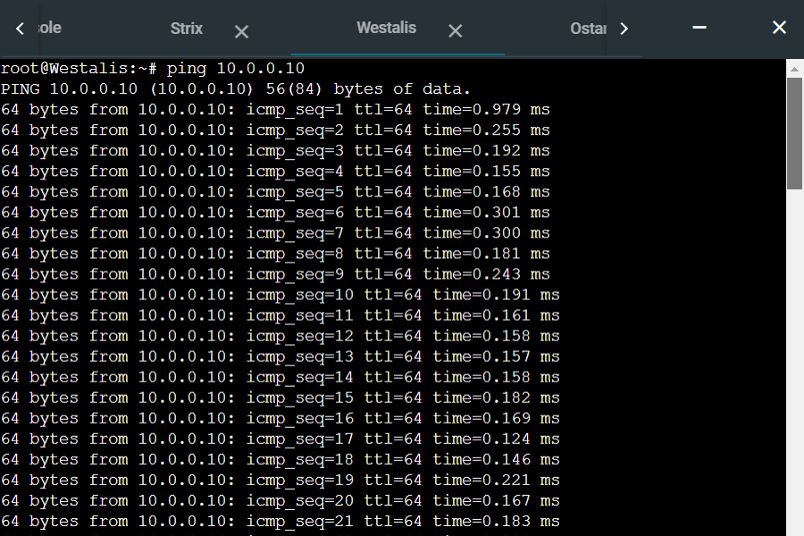

#### Tes ping ke Server Eden (3)
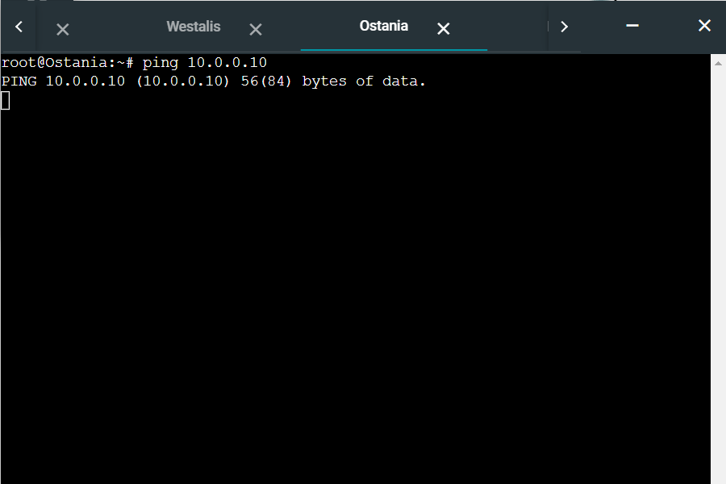

### 4.
Akses menuju Web Server hanya diperbolehkan disaat jam kerja yaitu Senin sampai Jumat pada pukul 07.00 - 16.00.

#### Garden
```
iptables -A INPUT -m time --timestart 07:00 --timestop 16:00 --weekdays Mon,Tue,Wed,Thu,Fri -j ACCEPT
iptables -A INPUT -j DROP
```

#### SSS
```
iptables -A INPUT -m time --timestart 07:00 --timestop 16:00 --weekdays Mon,Tue,Wed,Thu,Fri -j ACCEPT
iptables -A INPUT -j DROP
```

#### Tes ping ke Server SSS
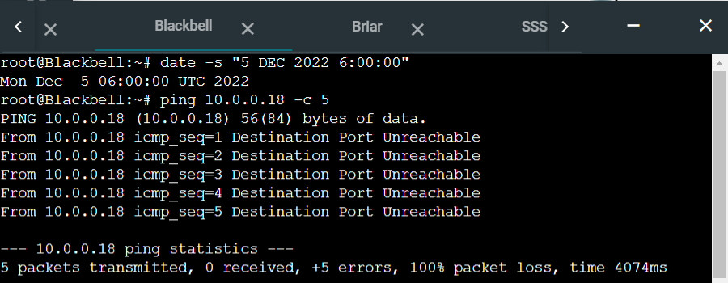
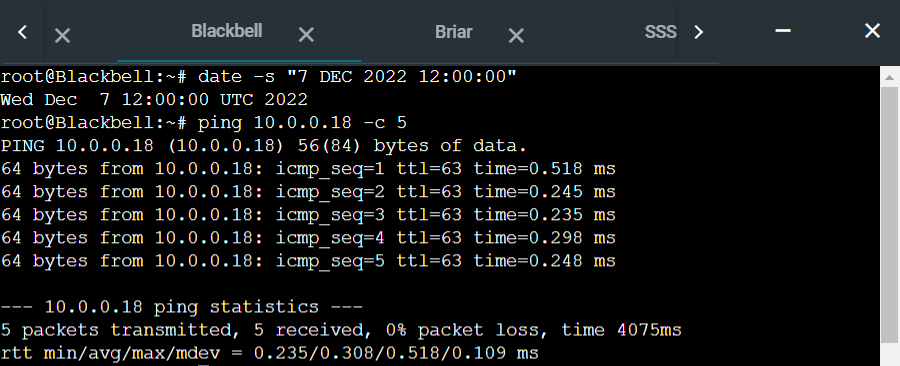
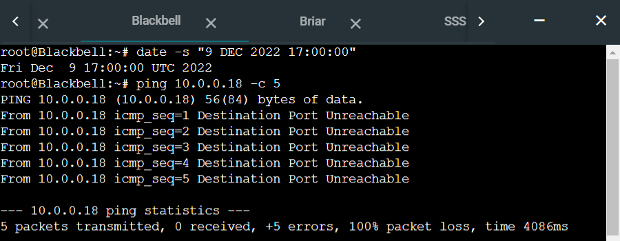

### 5.
Karena kita memiliki 2 Web Server, Loid ingin Ostania diatur sehingga setiap request dari client yang mengakses Garden dengan port 80 akan didistribusikan secara bergantian pada SSS dan Garden secara berurutan dan request dari client yang mengakses SSS dengan port 443 akan didistribusikan secara bergantian pada Garden dan SSS secara berurutan.

#### Ostania
```
iptables -t nat -A PREROUTING -p tcp -d 10.0.0.18 --dport 443 -m statistic --mode nth --every 2 --packet 1 -j DNAT --to-destination 10.0.0.19:443
iptables -t nat -A PREROUTING -p tcp -d 10.0.0.19 --dport 80 -m statistic --mode nth --every 2 --packet 1 -j DNAT --to-destination 10.0.0.18:80
```

#### Buka web port 80 milik Server Garden dari client Blackbell
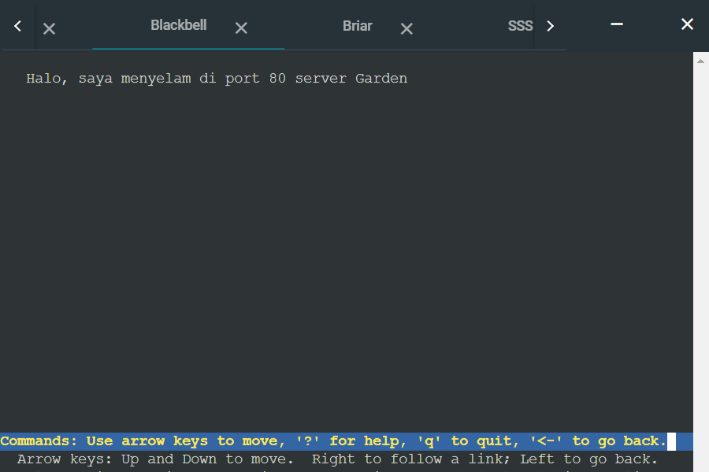

#### Buka web port 80 milik Server Garden dari client Briar
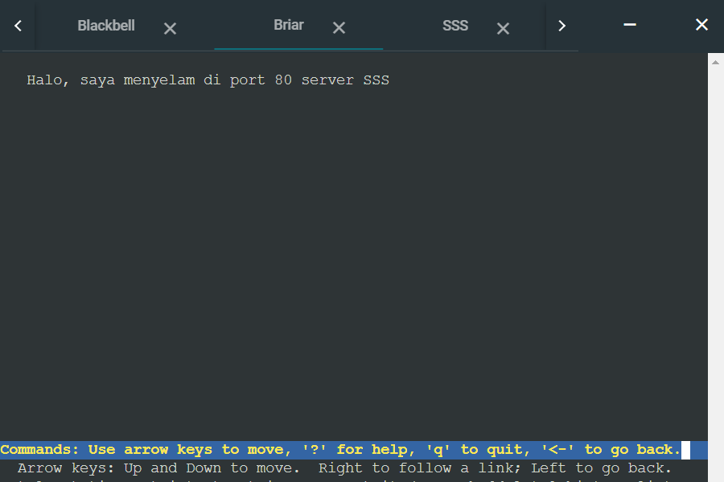

### 6.
Karena Loid ingin tau paket apa saja yang di-drop, maka di setiap node server dan router ditambahkan logging paket yang di-drop dengan standard syslog level.

Buat chain baru bernama `LOGGING`. Chain ini diberi rules sedimikian rupa sehingga packet yang masuk ke chain ini akan di-log baru kemudian di drop.
```
iptables -N LOGGING
iptables -A LOGGING -j LOG --log-prefix "IPTables-Dropped: " --log-level 4
iptables -A LOGGING -j DROP
```
Kemudian ganti semua `DROP` pada rules yang telah dibuat. Sebagai contoh rules pada strix
```
iptables -A FORWARD -p tcp -d 10.0.0.11 -i eth0 -j DROP
iptables -A FORWARD -p udp -d 10.0.0.11 -i eth0 -j DROP
```
Diubah menjadi
```
iptables -A FORWARD -p tcp -d 10.0.0.11 -i eth0 -j LOGGING
iptables -A FORWARD -p udp -d 10.0.0.11 -i eth0 -j LOGGING
```

## Kendala

Hasil log tidak muncul di file `/var/log/syslog`, `/var/log/messages`, ataupun `/var/log/kern.log`. Sudah dilakukan setting `ryslog` tapi tetap tidak muncul.
